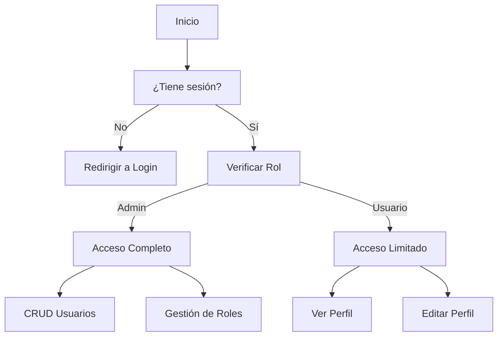

# Gestión de Usuarios

## Estructura de Archivos
```
Controllers/
└── UserController.php    # Controlador principal de usuarios

Services/
└── UserService.php      # Lógica de negocio de usuarios

Repositories/
├── SupabaseUserRepository.php  # Implementación de repositorio
└── UserRepositoryInterface.php # Interfaz del repositorio

Models/
├── User.php            # Modelo de usuario
└── Role.php            # Modelo de roles

Presentation/users/
├── create.php          # Formulario de creación
├── edit.php            # Formulario de edición
└── index.php           # Listado de usuarios
```

## Flujo de Operaciones CRUD

### 1. Creación de Usuarios
**Archivos involucrados:**
- `UserController::create()`
- `UserController::store()`
- `UserService::createUser()`
- `SupabaseUserRepository::create()`
- `Presentation/users/create.php`

**Validaciones:**
- Nombre requerido (mínimo 3 caracteres)
- Email válido y único
- Contraseña segura (mínimo 8 caracteres, mayúsculas, minúsculas, números)
- Rol válido

**Proceso:**
1. Usuario accede a `/users/create`
2. Se muestra el formulario de creación
3. Al enviar, se validan los datos
4. Se crea el usuario en Supabase
5. Redirección al listado con mensaje de éxito

---

### 2. Lectura de Usuarios
**Archivos involucrados:**
- `UserController::index()`
- `UserService::getAll()`
- `SupabaseUserRepository::getAll()`
- `Presentation/users/index.php`

**Proceso:**
1. Usuario accede a `/users`
2. Se obtienen todos los usuarios del servicio
3. Se muestran en una tabla con opciones de acción

---

### 3. Actualización de Usuarios
**Archivos involucrados:**
- `UserController::edit($id)`
- `UserController::update($id)`
- `UserService::updateUser()`
- `SupabaseUserRepository::update()`
- `Presentation/users/edit.php`

**Validaciones:**
- Usuario debe existir
- Email único (excepto para el usuario actual)
- Contraseña opcional (si se proporciona, debe ser segura)

**Proceso:**
1. Usuario hace clic en "Editar"
2. Se carga el formulario con los datos actuales
3. Al enviar, se validan los datos
4. Se actualiza el usuario en Supabase
5. Redirección al listado con mensaje de éxito

---

### 4. Eliminación de Usuarios
**Archivos involucrados:**
- `UserController::delete($id)`
- `UserService::deleteUser()`
- `SupabaseUserRepository::delete()`

**Validaciones:**
- Usuario debe existir
- No se puede eliminar a sí mismo
- Confirmación de eliminación

**Proceso:**
1. Usuario hace clic en "Eliminar"
2. Se muestra confirmación
3. Al confirmar, se elimina el usuario
4. Redirección al listado con mensaje de éxito

## Diagrama de Flujo de Usuario


## Implementación de Roles

### Estructura de Roles
```php
// Models/Role.php
class Role {
    private $role_id;
    private $role_name;
    private $permissions; // JSON con permisos
    private $created_at;
    private $updated_at;
    
    // Getters y setters
}
```

### Operaciones CRUD para Roles
1. **Creación de Rol**
   - Validar nombre único
   - Definir permisos
   - Guardar en Supabase

2. **Asignación de Rol**
   - Validar que el rol existe
   - Asignar a usuario
   - Actualizar en Supabase

3. **Gestión de Permisos**
   - Estructura de permisos:
   ```json
   {
     "users": {
       "create": true,
       "read": true,
       "update": true,
       "delete": false
     },
     "reports": {
       "view": true,
       "export": false
     }
   }
   ```

### Middleware de Autenticación
```php
// Ejemplo de verificación de rol
function authorize($requiredRole) {
    $userRole = $_SESSION['user_role'] ?? null;
    
    if (!$userRole || $userRole !== $requiredRole) {
        http_response_code(403);
        echo 'Acceso no autorizado';
        exit;
    }
}
```

## Mejoras Futuras
- [ ] Autenticación de dos factores
- [ ] Historial de cambios
- [ ] Exportación a Excel/PDF
- [ ] Búsqueda y filtrado avanzado
- [ ] Perfiles personalizables

## Notas de Implementación
- Todas las contraseñas se hashean antes de guardar
- Las sesiones tienen tiempo de expiración
- Los logs de actividad se guardan en Supabase
- Se recomienda implementar rate limiting para las APIs
